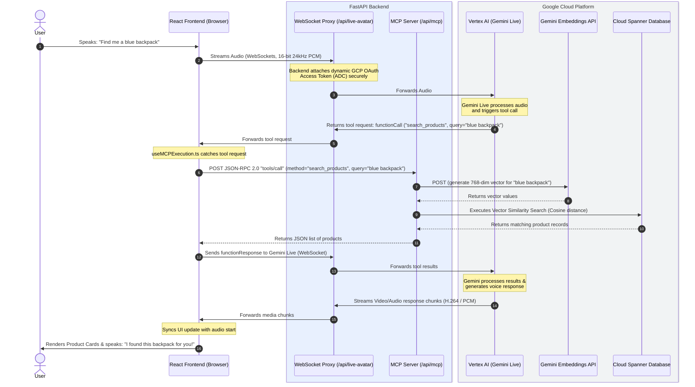

# Multimodal Live Avatar E-Commerce Assistant

An end-to-end conversational shopping assistant powered by **Gemini Live**, **Vertex AI**, **Cloud Spanner**, and the **Model Context Protocol (MCP)**. This project enables natural, low-latency voice and video interactions with an AI shopping avatar ("Vera") that can semantically search product catalogs, manage shopping carts, and process checkout orders in real time.

---

## Table of Contents

- [Overview](#overview)
- [Key Features](#key-features)
- [Architecture](#architecture)
  - [High-Level Sequence Diagram](#high-level-sequence-diagram)
  - [Core Components](#core-components)
  - [How Model Context Protocol (MCP) Works](#how-model-context-protocol-mcp-works)
  - [Security & WebSocket Proxy Architecture](#security--websocket-proxy-architecture)
- [Repository Structure](#repository-structure)
- [Prerequisites & GCP Setup](#prerequisites--gcp-setup)
  - [1. Enable Google Cloud APIs](#1-enable-google-cloud-apis)
  - [2. Authenticate Local Environment](#2-authenticate-local-environment)
  - [3. Configure Environment Variables](#3-configure-environment-variables)
  - [4. Provision Cloud Spanner & Catalog Data](#4-provision-cloud-spanner--catalog-data)
- [Local Deployment](#local-deployment)
  - [Option A: Full Development Mode (Vite HMR + FastAPI)](#option-a-full-development-mode-vite-hmr--fastapi)
  - [Option B: Monolithic Local Production Mode](#option-b-monolithic-local-production-mode)
- [Cloud Run Deployment](#cloud-run-deployment)
  - [Containerization Overview](#containerization-overview)
  - [Deploy Using Script (`deploy.sh`)](#deploy-using-script-deploysh)
  - [Manual Deployment via `gcloud run deploy`](#manual-deployment-via-gcloud-run-deploy)
- [Available Application Views](#available-application-views)
- [Troubleshooting](#troubleshooting)

---

## Overview

Traditional e-commerce chatbots rely on disjointed, turn-based text prompts. This application delivers a fluid shopping experience that mirrors an in-store personal shopper:
- **Speaks and listens naturally**: Employs bidirectional audio streaming (16-bit 24kHz PCM) with Gemini Live over WebSockets.
- **Renders a live video avatar**: Streams real-time animated video (H.264 video chunks decoded with `mpegts.js`).
- **Executes real-time actions**: Intercepts `functionCall` events via the Model Context Protocol (MCP) to query product inventory, add items to the user's cart, and complete purchases on Cloud Spanner.
- **Adapts dynamically to brands**: Offers dynamic brand theming (color schemes and typography) generated in real time with Gemini.

---

## Key Features

- **Real-Time Multimodal Voice & Video**:
  - Live microphone capture with client-side Voice Activity Detection (VAD) and interruption handling.
  - Video stream rendering of the avatar assistant synchronized with spoken audio responses.
- **Model Context Protocol (MCP) Server**:
  - JSON-RPC 2.0 interface (`/api/mcp`) exposing e-commerce capabilities (`search_products`, `add_to_cart`, `get_cart`, `update_cart_item`, `remove_from_cart`, `checkout_cart`).
  - Decoupled client execution: the frontend catches model tool requests, invokes the backend MCP endpoints, and updates the UI synchronously.
- **Cloud Spanner Hybrid Relational & Vector Search**:
  - Catalog schema utilizing `ARRAY<FLOAT32>(vector_length=>768)` embeddings for semantic similarity search with `COSINE_DISTANCE`.
  - Full-text search tokenization (`TOKENLIST`) combined with price range filtering.
  - Interleaved tables (`order_items`, `reviews`) ensuring ACID transactional consistency for carts and orders.
- **Secure WebSocket & Auth Gateway**:
  - Client connections route through a FastAPI WebSocket proxy (`/api/live-avatar`).
  - Upstream connections to Vertex AI use short-lived GCP OAuth access tokens generated via Application Default Credentials (ADC), preventing client credential leakage.
- **Admin Control & Synthetic Data Pipeline**:
  - `/admin` dashboard allowing dynamic retailer brand switching, Spanner database resets, and real-time data seeding logs.
  - Automated synthetic catalog generation using Gemini, Imagen (product image generation), and multimodal embeddings (`gemini-embedding-2`).

---

## Architecture

### High-Level Sequence Diagram

The following diagram illustrates how the **React Frontend**, **FastAPI Backend**, **Vertex AI (Gemini Live)**, and **Cloud Spanner** collaborate during an interaction:



### Core Components

1. **React Frontend (`ecommerce/frontend`)**:
   - Built with **React 19**, **TypeScript**, **Vite**, and **Material-UI (MUI)**.
   - [useAudioRecorder.ts](ecommerce/frontend/src/hooks/useAudioRecorder.ts): Handles browser microphone capture, audio worklet downsampling to 16-bit 24kHz mono PCM, and real-time audio chunk transmission.
   - [networkWorker.ts](ecommerce/frontend/src/workers/networkWorker.ts): Offloads WebSocket transport to a dedicated Web Worker thread to prevent UI freezing during continuous audio/video streaming.
   - [useMCPExecution.ts](ecommerce/frontend/src/hooks/useMCPExecution.ts): Catches Gemini's `functionCall` messages from the stream, invokes the backend MCP endpoint via JSON-RPC, dispatches UI state updates (e.g., rendering product cards, updating cart totals), and returns `functionResponse` back to the live session.
   - [AvatarDisplay1P.tsx](ecommerce/frontend/src/components/AvatarDisplay1P.tsx): Renders the virtual assistant video feed in an HTML5 video player via `mpegts.js`.

2. **FastAPI Backend (`ecommerce/backend`)**:
   - [main.py](ecommerce/backend/main.py): Application entry point; mounts REST routes, WebSocket handlers, and serves compiled frontend static assets for single-container deployment.
   - [websocket.py](ecommerce/backend/routes/websocket.py): The WebSocket proxy (`/api/live-avatar`). Connects to `wss://{location}-aiplatform.googleapis.com/.../BidiGenerateContent`, injecting server-side Google OAuth tokens.
   - [mcp.py](ecommerce/backend/routes/mcp.py): Model Context Protocol server exposing `tools/list` and `tools/call`.
   - [database.py](ecommerce/backend/database.py): Cloud Spanner data access layer managing transactions, vector searches (`COSINE_DISTANCE`), shopping cart sessions, and orders.
   - [auth.py](ecommerce/backend/auth.py): Authenticates with Google Cloud via `google.auth.default(scopes=['.../auth/cloud-platform'])` to issue short-lived OAuth access tokens on demand.
   - [admin.py](ecommerce/backend/routes/admin.py): Admin endpoints for brand theme customization and launching asynchronous database seeding tasks.

3. **Google Cloud Services**:
   - **Vertex AI Gemini Live (`gemini-3.5-live-preview`)**: Bidirectional generative AI model handling multi-turn conversational audio and video avatar generation.
   - **Gemini Embeddings (`gemini-embedding-2`)**: Generates 768-dimensional text embeddings for catalog indexing and semantic search queries.
   - **Cloud Spanner**: High-performance, distributed relational database storing catalog items, text/image embeddings, shopping carts, and order histories.
   - **Cloud Storage (GCS)**: Stores synthetic product images generated by the seeding pipeline.
   - **Cloud Run**: Serverless container runtime hosting the unified application.

### How Model Context Protocol (MCP) Works

The Model Context Protocol standardizes how LLMs interact with external systems. In this architecture:
- **Tool Discovery (`tools/list`)**: When the session initializes, the frontend registers the available tools declared by the backend:
  - `search_products`: Semantic product search with text query and optional price filters.
  - `add_to_cart`: Validates product inventory in Spanner and adds items to the active session.
  - `get_cart`: Returns the items and current subtotal for the user's session.
  - `update_cart_item`: Adjusts item quantities or removes items when set to 0.
  - `remove_from_cart`: Drops an item from the active cart.
  - `checkout_cart`: Converts the cart into a permanent order with line items.
- **Tool Execution (`tools/call`)**: When Gemini Live determines a tool is needed, it emits a `functionCall`. The frontend intercepts it, executes the request against the backend's `/api/mcp` endpoint, and forwards the result back to Gemini so it can incorporate real inventory data into its speech.

### Security & WebSocket Proxy Architecture

Vertex AI's Gemini Live WebSocket API requires Google Cloud authentication. Connecting directly from a client browser introduces a significant vulnerability: credentials or private API keys would be exposed in the browser's network tab or bundle.

```
+------------------+                   +--------------------+                   +--------------------+
|  React Frontend  |  Local WebSocket  |  FastAPI Backend   |  Google WebSocket  | Vertex AI (Google) |
|     (Browser)    | ================= | (WebSocket Proxy)  | ================== | (Gemini Live API)  |
|                  |                   |  Attaches GCP Auth |                   |                    |
+------------------+                   +--------------------+                   +--------------------+
```

- The frontend connects **only** to the internal `/api/live-avatar` WebSocket endpoint.
- The backend uses **Application Default Credentials (ADC)** from the server environment, generates a scoped, short-lived OAuth token, and opens the upstream WebSocket connection to Vertex AI.
- Media streams and tool calls are piped bidirectionally across the proxy while keeping API keys and GCP service accounts completely private.

---

## Repository Structure

```
.
├── Dockerfile                           # Multi-stage build (React frontend + FastAPI backend)
├── deploy.sh                            # Deployment script for Cloud Run
├── Developer's guide to Gemini Live Avatar.pdf  # Additional technical documentation
├── ecommerce/
│   ├── backend/
│   │   ├── auth.py                      # GCP ADC token provider
│   │   ├── config.py                    # Environment settings configuration
│   │   ├── database.py                  # Cloud Spanner client & vector queries
│   │   ├── main.py                      # FastAPI application entry point
│   │   ├── pyproject.toml               # Python dependencies and metadata
│   │   ├── schema.sql                   # Spanner DDL definitions
│   │   ├── services.py                  # Client singletons (GenAI, Spanner, Auth)
│   │   ├── DataGenerator/
│   │   │   ├── generate_data.py         # Synthetic catalog generator (Gemini + Imagen)
│   │   │   └── requirements.txt         # Data generator dependencies
│   │   ├── DatabaseSetup/
│   │   │   ├── setup_spanner.py         # Spanner instance & database provisioning
│   │   │   └── clear_data.py            # Truncates tables & clears GCS images
│   │   └── routes/
│   │       ├── admin.py                 # Admin dashboard & seeding task endpoints
│   │       ├── config.py                # Retailer configuration & theme generation
│   │       ├── mcp.py                   # JSON-RPC 2.0 MCP tool endpoints
│   │       ├── products.py              # Product retrieval & cached image serving
│   │       └── websocket.py             # Authenticated Gemini Live WebSocket proxy
│   ├── doc/
│   │   └── architecture_walkthrough.md  # Detailed architecture walkthrough
│   └── frontend/
│       ├── package.json                 # Node dependencies
│       ├── vite.config.ts               # Vite configuration with /api proxy
│       └── src/
│           ├── App.tsx                  # Main application routing and UI views
│           ├── components/
│           │   ├── ArchitecturePage.tsx # Interactive architecture diagram & explorer
│           │   ├── AvatarDisplay1P.tsx  # H.264 video avatar display via mpegts.js
│           │   ├── MobileViewPage.tsx   # Mobile phone simulator view
│           │   └── ProductCard.tsx      # Interactive product card component
│           ├── hooks/
│           │   ├── useAudioRecorder.ts  # Mic capture & 24kHz PCM downsampling
│           │   └── useMCPExecution.ts   # Intercepts tool calls and invokes MCP
│           └── workers/
│               └── networkWorker.ts     # Dedicated WebSocket streaming Web Worker
```

---

## Prerequisites & GCP Setup

Before running the application locally or deploying to Google Cloud, ensure you have:

1. **Google Cloud SDK (`gcloud`)** installed and configured:
   ```bash
   gcloud version
   ```
2. **Node.js** (v20+) and **npm**:
   ```bash
   node -v
   npm -v
   ```
3. **Python** (v3.11 or v3.12+) and `pip` (or `uv`):
   ```bash
   python3 --version
   ```

### 1. Enable Google Cloud APIs

Enable the required services in your target Google Cloud project:

```bash
gcloud services enable \
    aiplatform.googleapis.com \
    spanner.googleapis.com \
    storage.googleapis.com \
    run.googleapis.com \
    artifactregistry.googleapis.com \
    cloudbuild.googleapis.com \
    --project YOUR_PROJECT_ID
```

### 2. Authenticate Local Environment

Ensure Application Default Credentials (ADC) are configured so the backend can issue OAuth tokens:

```bash
gcloud auth login
gcloud auth application-default login
gcloud config set project YOUR_PROJECT_ID
```

### 3. Configure Environment Variables

Create or update `ecommerce/backend/.env`:

```env
# Google Cloud Project Configuration
GOOGLE_CLOUD_PROJECT=YOUR_PROJECT_ID
GOOGLE_CLOUD_LOCATION=us-central1
VERTEX_PROJECT_ID=YOUR_PROJECT_ID
VERTEX_LOCATION=us-central1

# Cloud Spanner Configuration
SPANNER_INSTANCE=ecommerce-instance
SPANNER_DATABASE=catalog-db
SPANNER_LOCATION=us-central1

# Cloud Storage Bucket for Generated Images
GCS_BUCKET_NAME=YOUR_GCS_BUCKET_NAME

# Models Configuration
GEMINI_LIVE_MODEL=gemini-3.5-live-preview
MULTIMODAL_EMBEDDING_MODEL=gemini-embedding-2
MULTIMODAL_EMBEDDING_LOCATION=global
IMAGE_GENERATION_MODEL=gemini-2.5-flash-image
VQA_MODEL=gemini-2.5-flash

# Active Retailer Brand
RETAILER="Retail"
```

> **Note on GCS Bucket**: Create a bucket for storing generated product images if you plan to run the data generation script:
> ```bash
> gcloud storage buckets create gs://YOUR_GCS_BUCKET_NAME --location=us-central1 --project=YOUR_PROJECT_ID
> ```

### 4. Provision Cloud Spanner & Catalog Data

#### Provision the Spanner Instance & Database
Run the setup script to provision a 100-processing-unit Cloud Spanner instance and apply the schema defined in `schema.sql`:

```bash
cd ecommerce/backend
python DatabaseSetup/setup_spanner.py
```

#### Seed Synthetic Catalog Products
Populate the database with synthetic products, Imagen-generated imagery, and Gemini embeddings:

```bash
python DataGenerator/generate_data.py --products 20 --customers 50 --orders 100
```

*(Optional)* To reset the database and clear generated images:
```bash
python DatabaseSetup/clear_data.py
```

---

## Local Deployment

You can run the project in **Full Development Mode** (separate backend server + Vite HMR dev server) or **Monolithic Production Mode** (built frontend served directly by FastAPI).

### Option A: Full Development Mode (Vite HMR + FastAPI)

This is the recommended workflow for developing features.

#### Step 1: Start the FastAPI Backend
Open a terminal:
```bash
cd ecommerce/backend

# (Optional) Create and activate a virtual environment
python3 -m venv .venv
source .venv/bin/activate

# Install dependencies
pip install -r pyproject.toml
# Or using uv:
# uv pip install -r pyproject.toml

# Start the server on port 8080
python -m uvicorn main:app --host 0.0.0.0 --port 8080 --reload
```
The backend API will be running at `http://localhost:8080`.

#### Step 2: Start the React Frontend
Open a second terminal:
```bash
cd ecommerce/frontend

# Install node dependencies
npm install

# Start Vite dev server
npm run dev
```
Open your browser and navigate to `http://localhost:5173`. 
The Vite dev server automatically proxies all `/api` and WebSocket requests to `http://localhost:8080`.

---

### Option B: Monolithic Local Production Mode

To test the container-like monolithic behavior locally (where FastAPI serves the built frontend):

```bash
# 1. Build the React frontend
cd ecommerce/frontend
npm install
npm run build

# 2. Run the FastAPI backend from the backend directory
cd ../backend
python -m uvicorn main:app --host 0.0.0.0 --port 8080
```
Open your browser at `http://localhost:8080`. FastAPI will serve the bundled React app from `ecommerce/frontend/dist` and handle all API/WebSocket endpoints on the same port.

---

## Cloud Run Deployment

The application is packaged as a single container using a multi-stage Docker build:
1. **Stage 1 (`frontend-builder`)**: Builds the React single-page application (`npm run build`).
2. **Stage 2 (`python:3.11-slim`)**: Installs Python dependencies using `uv`, copies backend source files, copies the built frontend assets into `/app/frontend/dist`, and starts Uvicorn on port 8080.

### Containerization Overview

The included `Dockerfile` ensures zero-dependency client packaging:
```dockerfile
# Stage 1: Build the React frontend
FROM node:20-alpine AS frontend-builder
WORKDIR /app/frontend
COPY ecommerce/frontend/package*.json ./
RUN npm ci
COPY ecommerce/frontend/ ./
RUN npm run build

# Stage 2: Build the FastAPI backend and serve everything
FROM python:3.11-slim
WORKDIR /app
RUN apt-get update && apt-get install -y --no-install-recommends build-essential && rm -rf /var/lib/apt/lists/*
COPY ecommerce/backend/pyproject.toml ecommerce/backend/uv.lock ./
RUN pip install --no-cache-dir uv && uv pip install --system -r pyproject.toml
COPY ecommerce/backend/ ./
COPY --from=frontend-builder /app/frontend/dist /app/frontend/dist
ENV PORT=8080
EXPOSE 8080
CMD ["python", "-m", "uvicorn", "main:app", "--host", "0.0.0.0", "--port", "8080"]
```

### Deploy Using Script (`deploy.sh`)

A helper script is provided at the root of the repository.

1. Review and edit `deploy.sh` to match your service account and project:
   ```bash
   chmod +x deploy.sh
   ./deploy.sh
   ```

The script parses environment variables from `ecommerce/backend/.env` and deploys the container directly to Cloud Run using Google Cloud Build.

### Manual Deployment via `gcloud run deploy`

To deploy manually using the Google Cloud CLI:

```bash
gcloud run deploy cymbal-avatar \
  --source . \
  --region us-central1 \
  --project YOUR_PROJECT_ID \
  --allow-unauthenticated \
  --min-instances 1 \
  --no-cpu-throttling \
  --memory 2Gi \
  --cpu 2 \
  --set-env-vars "GOOGLE_CLOUD_PROJECT=YOUR_PROJECT_ID,\
GOOGLE_CLOUD_LOCATION=us-central1,\
VERTEX_PROJECT_ID=YOUR_PROJECT_ID,\
VERTEX_LOCATION=us-central1,\
SPANNER_INSTANCE=ecommerce-instance,\
SPANNER_DATABASE=catalog-db,\
SPANNER_LOCATION=us-central1,\
GCS_BUCKET_NAME=YOUR_GCS_BUCKET_NAME,\
MULTIMODAL_EMBEDDING_LOCATION=global,\
GEMINI_LIVE_MODEL=gemini-3.5-live-preview,\
MULTIMODAL_EMBEDDING_MODEL=gemini-embedding-2,\
IMAGE_GENERATION_MODEL=gemini-2.5-flash-image,\
VQA_MODEL=gemini-2.5-flash,\
RETAILER=Retail"
```

#### Critical Cloud Run Configuration Flags:
- `--no-cpu-throttling`: **Mandatory for WebSocket stability.** By default, Cloud Run throttles CPU outside of active HTTP request processing. Because WebSockets represent long-lived continuous connections, disabling CPU throttling prevents streaming connections from stalling or disconnecting.
- `--min-instances 1`: Keeps at least one container warm to prevent cold starts during the initial WebSocket handshake and audio stream initiation.
- `--allow-unauthenticated`: Permits public browser access to the e-commerce storefront.

---

## Available Application Views

Once running, navigate through the application using the top navigation bar or direct URL paths:

| Path | View | Purpose |
| :--- | :--- | :--- |
| `/` | **Storefront** | The main desktop shopping experience featuring the live video avatar, voice conversation button, active product recommendations, and cart management. |
| `/mobile` | **Mobile Simulator** | Mobile viewport preview simulating an iOS/Android shopping experience with the digital avatar. |
| `/admin` | **Admin Dashboard** | Retailer brand management (switch between Target, Best Buy, Sephora, or custom retailers), database truncation, and live background catalog seeding logs. |
| `/arch` | **Architecture Walkthrough** | An interactive in-app visualizer explaining the system flow, Spanner schema explorer, and component interaction details. |

---

## Troubleshooting

### 1. WebSocket Disconnects with Code 1006 or 1011
- **Cause**: Vertex AI rejected the authentication token, or the model region is mismatched.
- **Solution**: 
  - Ensure `gcloud auth application-default login` has been executed.
  - Verify that `VERTEX_LOCATION` is set to a supported region for Gemini Live (e.g. `us-central1`).
  - Verify Cloud Run has `--no-cpu-throttling` enabled.

### 2. Microphone Capture Not Working
- **Cause**: Browser permissions or non-secure origin.
- **Solution**: 
  - Web Audio APIs require HTTPS (or `localhost`). If testing over a remote IP, configure an HTTPS domain or tunnel.
  - Ensure the browser has granted microphone access permissions.

### 3. Spanner "Instance Not Found" or "Database Not Found"
- **Cause**: The Cloud Spanner instance has not been provisioned or the ID in `.env` doesn't match.
- **Solution**:
  - Run `python ecommerce/backend/DatabaseSetup/setup_spanner.py` to create the instance and database.
  - Check the Spanner console in GCP to confirm `ecommerce-instance` and `catalog-db` exist.

### 4. Products Do Not Return During Search
- **Cause**: Catalog data has not been seeded, or embeddings failed to generate.
- **Solution**:
  - Run `python ecommerce/backend/DataGenerator/generate_data.py --products 20` to generate items and embeddings.
  - Check that the Vertex AI Embeddings API (`gemini-embedding-2`) is accessible from your project.
